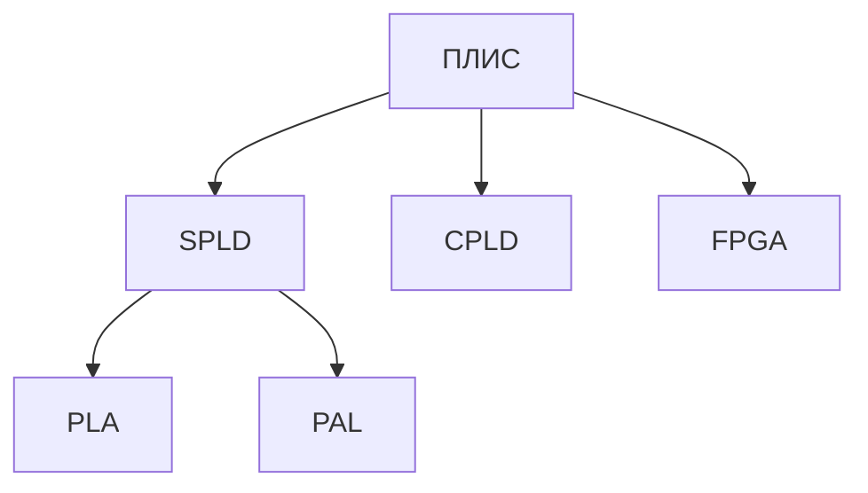
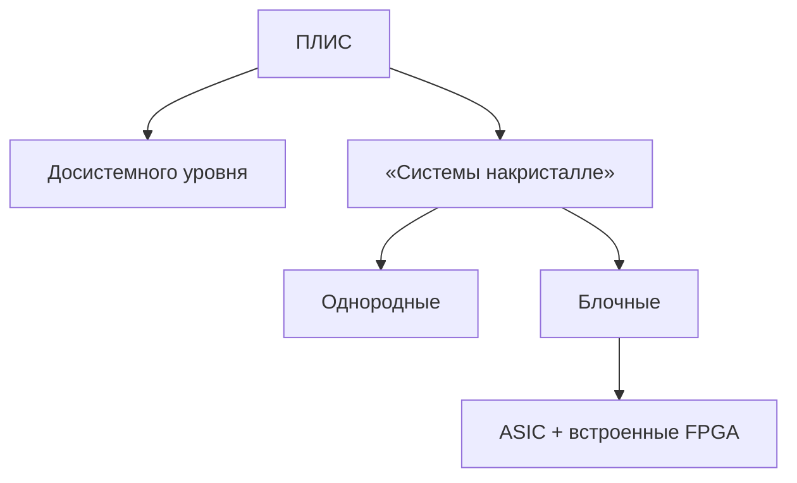
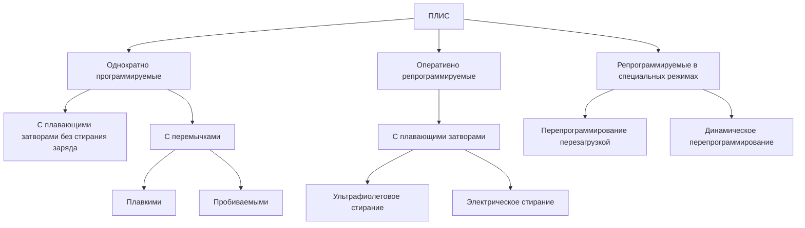
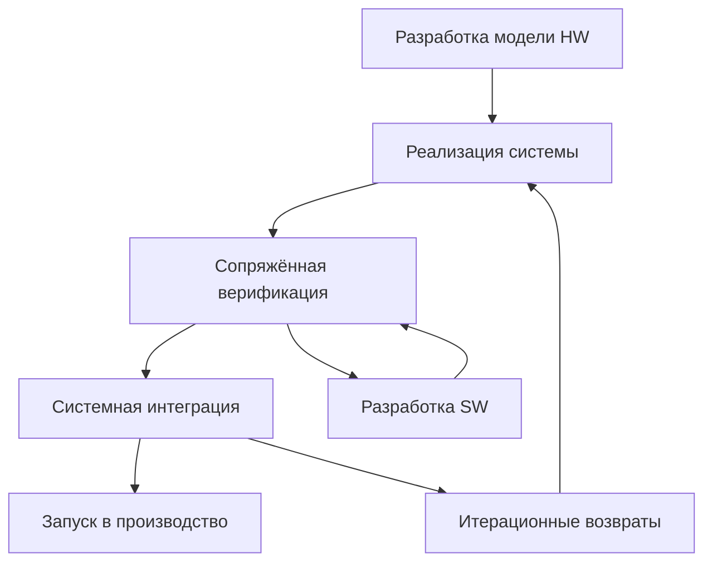

# PLIS
## Класификация ПЛИС
### SPLD
SPLD (Simple Programmable Logic Device) простейшие программируемые логические дивайсы разделяются на PLA и PAL
#### PLA
PLA (Programmable Logic Arrays) - программируемые логические матрицы, состоит из матрицы вентелей И и матрицей вентелей ИЛИ. Программируется плавкими перемычками  
#### PAL
PAL (Programmable Array Logic) - программируемые матрицы логики, состоит из программируемой части И матрицы и не программируемой матрицей ИЛИ. Программируется плавкими перемычками
### CPLD
CPLD (Complex Programmable Logic Device) - комплексные программируемые логические устройства
  
Структура CPLD включает:
1. Логические блоки (макроблоки):
    - Основа схемы — содержит логические функции, таблицы истинности (Look-Up Tables, PAL/PLA-структуры), триггеры.
    - Типичная структура: логика на базе PAL/PLA + триггеры + выходные буферы.
2. Межсоединительная матрица (Interconnect Matrix):
    - Связывает логические блоки между собой.
    - Обычно глобальная и фиксированная — не такая гибкая, как в FPGA, но проще и предсказуемее.
3. Конфигурационная память:
    - Энергонезависимая Flash или EEPROM, сохраняет конфигурацию даже при отключении питания.
    - Возможна многократная перепрошивка.
Основные свойства CPLD:

| Характеристика                    | Описание                                                        |
|-----------------------------------|-----------------------------------------------------------------|
|Конфигурация	                    |Постоянная, сохраняется при выключении питания                   |
|Простота проектирования	        |Близки по логике к обычным PLD — легко понять и использовать     |
|Невысокая плотность логики	        |Обычно десятки – тысячи логических элементов                     |
|Быстрая и предсказуемая задержка	|Задержки между блоками постоянны и легко моделируются            |
|Небольшое энергопотребление	    |Особенно по сравнению с SRAM FPGA                                |
|Подходит для "грубых" логик	    |Декодеры адресов, интерфейсы, FSM (конечные автоматы), glue logic|
### FPGA
FPGA (Field Programmable Gate Arrays) - Программируемые пользователем вентильные матрицы  
Cостоит из:
- LUT (Look-Up Table)
- множество функциональных блоков
- система межсоединений(отличается от CPLD)
- Энергозависимая память конфигурации
<a id="ip-блоки"></a>
## IP блоки
IP-блоки (Intellectual Property blocks) — это готовые, предварительно разработанные и верифицированные модули для ПЛИС (FPGA) и ASIC, которые можно интегрировать в проект для ускорения разработки. Они бывают аппаратными (реализованы в железе) и программными (на HDL-коде).  
Пример:
- Интерфейсы: UART, SPI, I2C, Ethernet, USB
- Память: FIFO, DDR3/4 контроллеры, RAM/ROM
- Арифметика: Целочисленные/FPU ALU, DSP-блоки (умножители, FFT)
разделяют Hard IP и Soft IP
### Hard IP
Аппаратно-зависимый блок, выпускаемый, как правило, под конкретное семейство ПЛИС, ему соответствует ASIC – структура внутри ПЛИС  
Пример:
- АЦП, ЦАП
- PLL
### Soft IP
Аппаратно-независимый блок, использование которого не зависит от конкретной ПЛИС. Применяется для построения составных частей СнК на регулярной структуре  
Пример:
- интерфейсы: UART, SPI, I2C
- FIFO
## LUT
LUT (Look-Up Table, таблица перекодировки) — это базовый элемент комбинационной логики в ПЛИС (FPGA), который реализует произвольную логическую функцию от нескольких входов.  
LUT с N входами хранит $2^N$ бит (все возможные комбинации выходов для входных значений).
  
простая визуализация LUT, ячейки и мультиплексоры
## DSP-ячейки 
DSP-ячейки (Digital Signal Processing blocks) — это специализированные аппаратные блоки в ПЛИС (FPGA), предназначенные для эффективного выполнения математических операций: умножения, сложения, умножения с накоплением (MAC) и других задач цифровой обработки сигналов (ЦОС). Они существенно ускоряют вычисления по сравнению с реализацией тех же операций на обычной логике (LUT).
## Типы присваивания 
### Блокирующее присваивание (=)
Выполняется немедленно и блокирует выполнение последующих операций до своего завершения.
```verilog
always @(*) begin
    a = b + c;  // Сначала вычисляется a
    d = a << 1;  // Затем d (используется новое значение a)
end
```
Cинтезируется в комбинационную логику
### Неблокирующее присваивание (<=)
Все присваивания в блоке выполняются параллельно (правые части вычисляются одновременно, а присваивания происходят в конце временного шага).
```verilog
always_ff @(posedge clk) begin
    q1 <= d;   // Все триггеры обновляются одновременно
    q2 <= q1;  // q2 получит значение q1 до обновления
end
```
Синтезируется в D-триггеры (регистры), работающие по фронту тактового сигнала.
<a id="система-межсоединений"></a>
## Система межсоединений

- Одинарной длины – соединяют ФБ между собой или горизонтальными линиями, соединяющие переключательные блоки (ПБ)
- Двойной длины – соединяют переключательные блоки через один
- Длинные линии используются для соединения областей кристалла между собой
## ФАПЧ
ФАПЧ(фазовая автоподстройка частоты)
  
ГУН – генератор частоты, управляемый напряжением  
Делитель 1/M – уменьшает опорную частоту, входная частота делится на M  
Делитель 1/N – уменьшает частоту петли обратной связи, выходная частота умножается на N  
Делитель 1/P – делит выходную частоту на P, опциональный и используется более тонкой настройки выходной частоты  
## Блочная память (Block RAM)

Распределена по всему кристалу  
Не имеет строгой организации и может быть сконфигурирована под различную разрядность данных в зависимости от задачи  
Как правило имеет двухпортовую организацию (чтение и запись)  
Может иметь внутренние схемы коррекции ошибок и конфигурируемый буфер FIFO  
Объём менее 50 Мбит даже для очень больших ПЛИС
<a id="блоки-ввода-вывода"></a>
## Блоки ввода/вывода 
  
Порты ввода-вывода сгруппированы в блоки дифференциальных пар, но могут работать независимо  
Блок ввода-вывода структурно разделяется на электрическую и логическую части
## JTAG интерфейс
JTAG – Joint Test Action Group – группа инженеров, задачей которых была выработка стандарта для проверки микросхем на работоспособность

- TDI (Test Data In) — вход данных
- TDO (Test Data Out) — выход данных
- TCK (Test Clock) — тактовый сигнал
- TMS (Test Mode Select) — управление режимами
- TRST (Test Reset) — сброс.
### Метод граничного сканирования
Метод граничного сканирования обеспечивает:
- Проверка функциональной работоспособности БИС с помощью встроенных в них тестовых цепей  
- проверка качества соединений между контактами различных БИС, смонтированных на печатной плате
- считывание или установка сигналов на выходных контактах БИС в штатном режиме работы БИС
Метод граничного сканирования реализуется:
- источник тестовых команд и данных (тестовый прибор, который может являться персональным компьютером, специализированным оборудованием, микросхемой на плате, или блоком микросхемы, отвечающий за тестирование)
- механизм информационной связи тестируемых БИС и тестового прибора
- схема управления JTAG –интерфейсом в каждой проверяемой микросхеме
### Режимы работы JTAG
- Режимы самотестирования БИС, режимы записи или чтения внутрисхемных запоминающих устройств и т.д.
- Режим тестирования соединения БИС между собой
- Режим тестирования штатной работы БИС
### Структура Сканирующей ячейки

### Диограмма состояний TAP-контроллера 

- Условие перехода между состояниями контролера – это состояние сигнала TMS (0-1)
- DR – data register
- IR – instruction register
### Системные функции JTAG
- Конфигурирование ПЛИС (в том числе загрузка в память и выбор различных конфигураций)
- Встраивание отладочных средств внутрь ПЛИС – средств самотестирования СнК или тестирования других микросхем, входящих в систему
- Внутрисхемная отладка – наблюдение состояния не только внутренних сигналов, но и состояния выводов микросхем (Tools - > Signal Tap)
### Стандарты JTAG
- BSDL — Boundary -Scan Description Language — язык описания организации и архитектуры граничного сканирования в рамках одиночной БИС
- HSDL — Hierarchical Scan Description Language (разработка фирмы Texas Instruments) — язык, ориентированный на описание информационных потоков в группе БИС, объединенных JTAG – интерфейсом - усовершенствованный язык по сравнению с BSDL – облегчает работу с интерфейсами, шинами и системами, состоящими из множества микросхем
- SVF – Serial Vector Format – упрощѐнный способ: подал тестовую последовательность (вектор), считал результат, сравнил с эталоном
### Главное JTAG 
- Необходимость поддержки этого стандарта диктуется возрастающей сложностью микросхем, печатных плат, систем и сетей на их основе
- Стандарт поддерживает гибкость тестирования за счѐт многообразия инструментов
- За время существования стандарт был дополнен различными «надстройками», отвечающими на развитие вычислительных средств, интерфейсов, сетей и т.п.
- Поддержка стандарта не требует значительных ресурсов микросхемы
- Встраивание систем самоконтроля обязательно для систем, применяемых в особо ответственных секторах (оборона, космос, телекоммуникации, медицина и т.п.)
## Системы на кристале СнК
совокупность аппаратных средств, обеспечивающих функции обмена информацией, еѐ обработки, хранения и управления этим процессом, выполненную на одном (программируемом) кристалле.
### Состав СнК
- Микропроцессор(ы)
- Память ОЗУ
- Память ПЗУ программ
- Системная шина (AMBA APB, AHB, AXI, Wishbone, OCP)
- Интерфейсы (UART, I2C, SPI, Ethernet)
- Сопроцессоры (аппаратные блоки) – ЦОС, крипто- и другие
### Система на программируемом кристале
|СБИС|          Характеристика           |ПЛИС|
|----|-----------------------------------|----|
| да |         энергозависимость         | да |
| да |     низкое энергопотребление      | да |
| нет|       перепрограммируемость       | да |
| нет| быстрый цикл разработки устройств | да |
| нет|   низкие затраты на производство  | да |
| нет| отсутствие затран на инж. образцы | да |
### Преймущества
- Уменьшается масса и габаритные размеры устройств за счѐт меньшего количества корпусов микросхем и их «обвязки»
- Увеличивается надѐжность за счѐт меньшего количества паяных соединений и высокой степени автоматизации тестирования и отладки
- Уменьшается стоимость при массовом выпуске
- Снижается энергопотребление
- Увеличивается быстродействие за счѐт уменьшения длин линий передачи данных и логических уровней передаваемых данных
- Появляется возможность поддержки операционных систем, в том числе, и реального времени
### Обобщённая структура микропроцессора

- АЛУ
- Умножители и делители (аппаратные)
- Блок операций с «плавающей» запятой (FPU)
- Специализированные вычислители: ЦОС, векторные и другие
### Микропроцессорные ядра
- Являются основой системы на кристалле (системы на программируемом кристалле)
- IP-ядро со средствами отладки
- Крупные производители ПЛИС стараются предоставить разработчику возможность использования МП собственной архитектуры, оптимизированной под выбранное семейство ПЛИС
- Есть встроенные hard-IP блоки в старших семействах ПЛИС, soft-IP для всех семейств ПЛИС
- Стоит вопрос о распределнии задач: программное/аппаратное решение
- Требуется отладка аппаратной и программных частей
# Вопросы к зачёту
## Классификация цифровых интегральных схем, подчеркните положение ПЛИС среди них.
Малая степень интеграции - десятки логических элементов.  
Средняя степень интеграции - сотни элементов.  
Большая степень интеграции - тысячи элементов.  
Сверх большая степень интеграции - миллионы элементов. 
ПЛИС имеет сверх большую интеграцию, она позволяют пользователю самостоятельно конфигурировать структуру схемы после изготовления, в отличие от ASIC, которые фиксированы при производстве.
## История возникновения и особенности программируемых логических микросхем.
Разработчики нуждались в гибкой замене жёстко заданных логических схем, особенно при создании небольших партий цифровых устройств. Появились [SPLD](#spld). Но SPLD это микросхемы малой степени интеграции из-за чего появились [CPLD](#cpld), которые были более производительными и имели большее количество транзисторов(по сути CPLD - это множество SPLD систем на кристале). Переход от CPLD к [FPGA](#fpga) произошёл из-за Лёгкой маштабируемости FPGA, потребность в сложной логике и параллелизме, FPGA имеют гибкую маршрутизацию и позволяют эффективно соединять любые блоки между собой — CPLD ограничены фиксированной архитектурой, появление специальных блогов в FPGA: PLL, RAM, DSP-блоки, Поддержка высокоскоростных интерфейсов.
## Общие (системные) свойства микросхем программируемой логики.
<details>
<summary> Универсальность и связанное с ней массовое производство</summary>
<ul>
<li>ПЛИС — гибкая микросхема общего назначения. На ней можно реализовать что угодно: от простых логических схем до целых процессоров.</li>
<li>Благодаря этой универсальности, одни и те же модели ПЛИС выпускаются массово, независимо от того, где и как будут использоваться.</li>
<li>Производителям выгодно делать типовые чипы, а функциональность определяет уже сам пользователь.</li>
</ul>
</details>
<details>
<summary> Низкая стоимость за счѐт массового производства</summary>
<ul>
<li>Поскольку все ПЛИС одинаковые "в железе", и только программируются по-разному, завод может выпускать огромные партии одного типа.</li>
<li>Это сильно снижает себестоимость: нет необходимости проектировать и изготавливать уникальные микросхемы под каждый проект (в отличие от ASIC).</li>
</ul>
</details>
<details>
<summary> Высокий процент выхода годных микросхем из-за «регулярной» структуры микросхем</summary>
<ul>
<li>Архитектура ПЛИС — регулярная, симметричная, с повторяющимися логическими блоками.</li>
<li>Это облегчает тестирование и снижает вероятность дефектов: если один блок не работает, остальные могут использоваться.</li>
<li>Возможны даже механизмы обхода дефектных участков, что увеличивает выход годных микросхем.</li>
</ul>
</details>
<details>
<summary> Высокое быстродействие и надѐжность за счѐт высокой степени интеграции</summary>
<ul>
<li>ПЛИС содержат сотни тысяч логических элементов на одном кристалле, без необходимости соединять десятки отдельных микросхем.</li>
<li>Отсутствие длинных внешних связей → меньше помех, меньше задержек, выше надёжность.</li>
<li>За счёт аппаратной реализации схем (вместо программной) достигается высокая скорость работы.</li>
</ul>
</details>
<details>
<summary> Разнообразие корпусов микросхем</summary>
<ul>
<li>ПЛИС выпускаются в разных форм-факторах: от компактных QFN до мощных BGA с сотнями выводов.</li>
<li>Это позволяет использовать их в самых разных условиях: от встраиваемых систем до промышленных решений.</li>
</ul>
</details>
<details>
<summary> Разнообразие в выборе напряжения питания выводов микросхемы и доступных физических интерфейсов в микросхемах</summary>
<ul>
<li>Современные ПЛИС поддерживают различные уровни логических сигналов: 1.2В, 1.8В, 2.5В, 3.3В и т.д.</li>
<li>Многие ПЛИС имеют встроенные буферы для популярных интерфейсов: LVTTL, LVCMOS, LVDS, SSTL, и др.</li>
<li>Это упрощает подключение к внешним устройствам без дополнительных компонентов.</li>
</ul>
</details>
<details>
<summary> Сильно развитые САПР</summary>
<ul>
<li>Под ПЛИС существует мощное ПО для проектирования: Xilinx Vivado, Intel Quartus, Lattice Diamond и др.
<li>Включают симуляцию, анализ временных диаграмм, автоматическую маршрутизацию и оптимизацию.</li>
<li>Позволяют работать на уровне как регистровой передачи (RTL), так и блочного проектирования.</li>
</ul>
</details>
<details>
<summary> Относительно низкий «порог входа»</summary>
<ul>
<li>В отличие от ASIC (где нужен заказ на производство, сложное тестирование и высокая стоимость), ПЛИС можно использовать "с порога": купить микросхему, скачать САПР и программировать.</li>
<li>Есть бесплатные версии ПО, открытые IP-ядра, обучающие платы — что делает их доступными даже студентам.</li>
</ul>
</details>
<details>
<summary> Меньшее время проектирования и отладки устройств</summary>
<ul>
<li>В отличие от разработки ASIC или проектирования жёсткой логики из отдельных микросхем, с ПЛИС:</li>
<ul>
<li>всё можно моделировать, отлаживать и менять в САПР,</li>
<li>программировать и тестировать прямо на целевой плате.</li>
</ul>
<li>Весь цикл — от идеи до прототипа — можно пройти за несколько дней или недель, а не месяцев.</li>
</ul>
</details>
<details>
<summary> Простота модификации проекта на любой стадии разработки</summary>
<ul>
<li>Поскольку логика ПЛИС программируется, её можно изменять в любой момент:</li>
<ul>
    <li>внести изменения в схему,</li>
    <li>заменить модуль,</li>
    <li>перепрошить чип — и всё без переделки платы.</li>
</ul>
<li>Это особенно важно на ранних стадиях разработки и при быстром прототипировании.</li>
</ul>
</details>

## Маршрут автоматизированного проектирования системы на основе ПЛИС.
Получение и/или анализ технического задания

<details>
<summary> Создание нового проекта (выбор семействаи типа ПЛИС, а также средств синтеза)</summary>
Критерии:
<ul>
<li>Ёмкость ПЛИС</li>
<li>Наличие САПР на предприятии</li>
<li>Максимальная частота работы</li>
<li>Наличие отладочного стенда</li>
<li>Наличие понятной документации</li>
<li>Поддержка различных напряжений питания</li>
<li>Количество портов ввода-вывода</li>
<li>Стоимость/доступность!</li>
</ul>
</details>

<details>
<summary> Подготовка описания проектируемого устройства в графической и/или текстовой форме</summary>
Критерии:
<ul>
<li>Создание структурной и функциональной схемы проектируемого устройства</li>
<li>Проектирование сложных современных устройств опирается не столько на создание новых модулей с уникальным функционалом, сколько на повторное использование и настройку уже существующих (IP-ядра)</li>
<li>Графическая форма – более наглядное представление структуры проекта – верхний уровень</li>
<li>Текстовые формы – как правило, внутри отдельных модулей</li>
</ul>
</details>

<details>
<summary> Функциональное моделирование</summary>
<ul>
<li>Предназначено для проверки функционала разработанных модулей проекта и всего проекта целиком</li>
<li>Проверка идѐт «снизу – вверх» - сначала проверяются составляющие, затем проект целиком</li>
<li>Для сложных проектов используются тестовые воздействия, написанные на на языках HDL (например, SystemVerilog), в случае поиска неработоспособности – анализ временных диаграмм </li>
<li>Функциональное моделирование не учитывает топологические задержки, температуру окружающей среды, уровень напряжения питания и прочие факторы «реального» мира </li>
<li>Удобно создать файл тестовых воздействий (testbench), который будет использован повторно на следующих этапах автоматизированного проектирования</li>
</ul>
</details>

<details>
<summary> Синтез</summary>
Происходит перевод графического и/или текстового описания проекта в ячейки выбранного семейства ПЛИС без учѐта размещения внутри ПЛИС, но с учѐтом имеющихся в семействе функциональных блоков


</details>

<details>
<summary> Верефикация после синтеза</summary>
<ul>
<li>Этот этап нужен для того, чтобы удостовериться, что после синтеза функционал разрабатываемого устройства не был потерян</li>
<li>Можно использовать тот же файл тестовых воздействий, который использовался на этапе функционального моделирования</li>
<li>Если результат неудовлетворительный – возврат на этапы 3-4.</li>
</ul>
</details>

<details>
<summary> Размещение и трассировка проекта на кристале</summary>
<ul>
<li>Каждый кристалл – микросхема ПЛИС характеризуется набором портов ввода/вывода, наличием PLL-блоков (ФАПЧблоков), элементов памяти, встроенными IP и т.д.</li>
<li>Размещение – использование ресурсов ПЛИС для задействования их под синтезированные блоки </li>
<li>Трассировка – обеспечение соединения блоков между собой и портами ввода-вывода</li>
<li>Основные «стратегии»: обеспечение минимальной занимаемой проектом площади кристалла или обеспечение максимальной производительности</li>
<li>Важную роль играют ограничения (constraints) – обеспечение минимальной тактовой частоты работы какого-либо блока, максимальной задержки между какими-либо парами сигналов, необходимость подключения блоков ввода-вода и прочими. См. «критический путь»</li>
<li>Проект виртуально размещается в кристалле, для того, чтобы удостовериться, что ресурсов кристалла (трассировочных, ФБ, IP и т.д.) достаточно, чтобы вместить синтезированный проект и при этом заданные ограничения были выполнены</li>
<li>Возможен возврат на предыдущие этапы проектирования</li>
</ul>
</details>

<details>
<summary> Верефикация после размещения и трассировки</summary>
Предназначен для проверки функционала после размещения и трассировки с учѐтом топологических задержек и учѐта внешних факторов, таких как:
<ul>
<li>Крайние значения рабочей температуры окружающей среды (-40 … +85 °C)</li>
<li>Минимальное и максимальное значение напряжения питания ядра </li>
</ul>
</details>

<details>
<summary> Программирование ПЛИС</summary>
Этап состоит из следующих процедур:
<ul>
<li>Создание конфигурационного файла («прошивки») для заданной ПЛИС и/или ПЗУ, хранящего конфигурацию</li>
<li>Загрузка конфигурационного файла в ПЛИС и/или ПЗУ конфигурации</li>
<li>Проверка контрольной суммы</li>
<li>Перезагрузка ПЛИС</li>
</ul>
</details>

<details>
<summary> Отладка на аппаратном уровне</summary>
Этап состоит из следующих процедур:
<ul>
<li>Проверка взаимодействия ПЛИС с периферией – устройствами ввода-вывода, внешней памятью, сопроцессорами и т.д.</li>
<li>Проверка устройства в реальных условиях эксплуатации (температура, изменение напряжения питания, подача неправильных сигналов, «звон» нажатия кнопок и т.д.)</li>
<li> Проводится, как правило, на отладочных стендах, которые имеют в своѐм составе нужную ПЛИС</li>
</ul>
</details>

Получение проекта, соответствующего
заданной спецификации

## Классификация программируемых логических интегральных схем по архитектурным признакам.


## Классификация программируемых логических интегральных схем по уровню интеграции.


## Классификация ПЛИС по количеству циклов перепрограммирования.

## Сложные программируемые логические устройства (CPLD), функциональные блоки, система межсоединений, блоки ввода/вывода, системные свойства
Основу CPLD составляет макроблок (Macrocell), который состоит из:
- Упрощённой табличной логики (PLA/AND-OR array)
- Фиксированных логических блоков (обычно на базе PAL)
- Регистров (D-триггеров)
- Мультиплексоров и выходной логики

Логический режим работы:
- Комбинационная логика реализуется через матрицу И-ИЛИ (AND-OR array) — предсказуемая, фиксированная структура.
- Можно сформировать любые логические функции над входами и внутренними сигналами.
- После логической обработки сигнал может либо напрямую идти на выход, либо быть сохранён в триггер.
Последовательностный режим работы:
- Каждый макроблок имеет регистровую часть, обычно — D-триггер с синхронизацией по фронту такта.
- Управление работой регистра:
    - Тактовый вход
    - Сброс/установка
    - Управляющие сигналы включения/удержания
- Возможен выбор: выход формируется комбинаторно или после регистрации.
### Блоки ввода/вывода (I/O blocks):
- Связывают CPLD с внешним миром.
- Могут быть сконфигурированы как вход, выход или двунаправленный.
- Часто содержат:
    - Логику согласования уровней
    - Буферы
    - Поддержку различных стандартов (3.3V, 5V)
    - Режим высокого импеданса (Hi-Z)
### Система межсоединений:
- Основа CPLD — централизованная шинная архитектура, а не маршрутизируемая матрица, как в FPGA.
- Все макроблоки соединяются через программируемую общую шину (interconnect matrix / switch matrix).
- Даёт определяемую задержку сигналов, что упрощает временной анализ.
## Программируемые пользователем вентильные матрицы (FPGA), функциональные блоки, система межсоединений, блоки ввода-вывода, системные свойства.

### Logic Cell
Основу всего FPGA составляет Logic Cell, которая состоит из:
- Табличной ФАЛ([LUT](#lut))
- Цепи переноса(Carry Chain)
- Регистры(DFF)
- Набор мультиплексоров(MUX)  
  
Логический режим работы:  
- Пара LUT3 и мультиплексор "d" используются как LUT4
- Путь следования данных не затрагивают цепь переноса  
  
Арифметический Режим работы Logic Cell:  
- Каждый LUT3 независимо формирует входной сигнал для полного сумматора
- Пусть следование данных проходит через цепи переноса
    - учитывается carry in
    - формируется carry out
- входной сигнал "d" не используется

Регистр в Logic Cell: В зависимоти от требуемой функцианольности, Logic Cell может сохранить результат в регистр, либо вывести на выход комбинаторно  
  
пример реальной Logic Cell  

### Блочная память
- Хранить крупные массивы данных в регистрах FPGA затратно и нерационально
- Для Хранения данных в FPGA существует блочная память(block ram) - структуры SRAM. "вплетённые" в матрицу межсоединений

### Аппаратные процессорные ядра
- Существует отдельный класс FPGA - устройства, имеющие в своём составе аппаратные процессорные ядра
- аппаратное ядро имеет ряд преимуществ по сравнению с софт проццесором:
    - Экономия ресурсов FPGA
    - В разы больше тактовая частота и более сложная микроархитектура ядер, высокая производительность 

### Блоки/ввода вывода
- Считывание и вывод сигналов во "внешний мир"
- Согласование уровней напряжений
- Базовую защиту от статического апряжения
- Буфиризацию сигналов
- Реализацию состояния высокого импеданса

### Матрица блоков межсоединений
- Отвечает за электрическую и логическую связность всех структур в FPGA
- Построен на базе матриц переключателей
- В улих памяти ячейки статической памяти  

## Конечный автомат (finite state machine, FSM)
Конечный автомат (finite state machine) – это абстракция, описывающая систему, которая имеет вход, выход, и конечное число внутренних состояний, а также функции переходов между состояниями. можно описать в виде графа переходв
  
либо таблицы.  
Существуют 2 основных конечных автоматам:
Автомат Мили – автомат, в котором выходные сигналы зависят от текущего состояния автомата и текущего значения входных сигналов  
Автомат Мура – автомат, в котором выходные сигналы зависят только от текущего состояния  

## Источники тактирования, критический путь, конвейеризация
### Источники тактирования: 
- Источники тактирования, критический путь, конвейеризация: Даёт стабильную частоту (обычно 4–50 МГц). Нужен внешний генератор или RC-цепь.
- RC-генератор: Дешёвый, не очень точный. Используется для некритичных задач.
- [PLL (Phase Locked Loop)](#ФАПЧ): Внутренний генератор частоты. Может умножать/делить тактовый сигнал, часто используется в FPGA/CPLD.
### критический путь
критический путь - максимальное значение времени через которое реакция схемы на смену входных значений  будет 
  
Fmax = 1/Tc, где Tc – максимальная задержка (критический путь)  
из-за чего происходит задержка в комбинационной схеме  
Пусть существует некоторая цифровая схема из трѐх одинаковых соединенных последовательно блоков комбинационной логики  
Задержка распространения одного блока логики равна Tpd Суммарная задержка распространения такой схемы будет равна: 3 х Tpd
  
## Конверизация
Задача: Можно ли уменьшить суммарную задержку представленной схемы, не нарушая еѐ функциональность?
  
Решение – преобразовать схему в конвейер, добавив регистры между блоками логики.  
  
Fmax = 1/max(Tpd 1, Tpd 2, Tpd 3);
## JTAG –интерфейс, стандарты, с ним связанные, и метод граничного сканирования.
## JTAG интерфейс
JTAG – Joint Test Action Group – группа инженеров, задачей которых была выработка стандарта для проверки микросхем на работоспособность  

- TDI (Test Data In) — вход данных
- TDO (Test Data Out) — выход данных
- TCK (Test Clock) — тактовый сигнал
- TMS (Test Mode Select) — управление режимами
- TRST (Test Reset) — сброс.
### Метод граничного сканирования
Метод граничного сканирования обеспечивает:
- Проверка функциональной работоспособности БИС с помощью встроенных в них тестовых цепей  
- проверка качества соединений между контактами различных БИС, смонтированных на печатной плате
- считывание или установка сигналов на выходных контактах БИС в штатном режиме работы БИС
Метод граничного сканирования реализуется:
- источник тестовых команд и данных (тестовый прибор, который может являться персональным компьютером, специализированным оборудованием, микросхемой на плате, или блоком микросхемы, отвечающий за тестирование)
- механизм информационной связи тестируемых БИС и тестового прибора
- схема управления JTAG –интерфейсом в каждой проверяемой микросхеме
### Режимы работы JTAG
- Режимы самотестирования БИС, режимы записи или чтения внутрисхемных запоминающих устройств и т.д.
- Режим тестирования соединения БИС между собой
- Режим тестирования штатной работы БИС
### Структура Сканирующей ячейки

### Диограмма состояний TAP-контроллера 

- Условие перехода между состояниями контролера – это состояние сигнала TMS (0-1)
- DR – data register
- IR – instruction register
### Системные функции JTAG
- Конфигурирование ПЛИС (в том числе загрузка в память и выбор различных конфигураций)
- Встраивание отладочных средств внутрь ПЛИС – средств самотестирования СнК или тестирования других микросхем, входящих в систему
- Внутрисхемная отладка – наблюдение состояния не только внутренних сигналов, но и состояния выводов микросхем (Tools - > Signal Tap)
### Стандарты JTAG
- BSDL — Boundary -Scan Description Language — язык описания организации и архитектуры граничного сканирования в рамках одиночной БИС
- HSDL — Hierarchical Scan Description Language (разработка фирмы Texas Instruments) — язык, ориентированный на описание информационных потоков в группе БИС, объединенных JTAG – интерфейсом - усовершенствованный язык по сравнению с BSDL – облегчает работу с интерфейсами, шинами и системами, состоящими из множества микросхем
- SVF – Serial Vector Format – упрощѐнный способ: подал тестовую последовательность (вектор), считал результат, сравнил с эталоном
### Главное JTAG 
- Необходимость поддержки этого стандарта диктуется возрастающей сложностью микросхем, печатных плат, систем и сетей на их основе
- Стандарт поддерживает гибкость тестирования за счѐт многообразия инструментов
- За время существования стандарт был дополнен различными «надстройками», отвечающими на развитие вычислительных средств, интерфейсов, сетей и т.п.
- Поддержка стандарта не требует значительных ресурсов микросхемы
- Встраивание систем самоконтроля обязательно для систем, применяемых в особо ответственных секторах (оборона, космос, телекоммуникации, медицина и т.п.)
## Метод граничного сканирования
Метод граничного сканирования обеспечивает:
- Проверка функциональной работоспособности БИС с помощью встроенных в них тестовых цепей  
- проверка качества соединений между контактами различных БИС, смонтированных на печатной плате
- считывание или установка сигналов на выходных контактах БИС в штатном режиме работы БИС
Метод граничного сканирования реализуется:
- источник тестовых команд и данных (тестовый прибор, который может являться персональным компьютером, специализированным оборудованием, микросхемой на плате, или блоком микросхемы, отвечающий за тестирование)
- механизм информационной связи тестируемых БИС и тестового прибора
- схема управления JTAG –интерфейсом в каждой проверяемой микросхеме
## Системы на кристалле, определение, структура
Системы на кристалле (System on Chip - SoC) или System on Programmable Chip - SoPC (система на программируемом кристалле) – совокупность аппаратных средств, обеспечивающих функции обмена информацией, еѐ обработки, хранения и управления этим процессом, выполненную на одном (программируемом) кристалле.
### Состав СнК
- Микропроцессор(ы)
- Память ОЗУ
- Память ПЗУ программ
- Системная шина (AMBA APB, AHB, AXI, Wishbone, OCP)
- Интерфейсы (UART, I2C, SPI, Ethernet)
- Сопроцессоры (аппаратные блоки) – ЦОС, крипто- и другие
## Встраиваемые процессоры, IP-блоки.
Встраиваемые процессоры (Embedded Processors):
Встраиваемый процессор — это процессор, являющийся частью более крупной системы (например, SoC, FPGA, CPLD) и используемый для управления, обработки сигналов, логики, обмена данными и т.п.
Основные характеристики:
- Разрабатываются под конкретные задачи (в отличие от универсальных CPU)
- Энергоэффективны, компактны, имеют упрощённую микроархитектуру
- Часто аппаратно встроены в SoC (например, ARM Cortex-M)
- Или реализуются в виде "soft-core" внутри FPGA (например, MicroBlaze, Nios II)
### IP блоки
IP-блоки (Intellectual Property blocks) — это готовые, предварительно разработанные и верифицированные модули для ПЛИС (FPGA) и ASIC, которые можно интегрировать в проект для ускорения разработки. Они бывают аппаратными (реализованы в железе) и программными (на HDL-коде).  
Пример:
- Интерфейсы: UART, SPI, I2C, Ethernet, USB
- Память: FIFO, DDR3/4 контроллеры, RAM/ROM
- Арифметика: Целочисленные/FPU ALU, DSP-блоки (умножители, FFT)
разделяют Hard IP и Soft IP
#### Hard IP
Аппаратно-зависимый блок, выпускаемый, как правило, под конкретное семейство ПЛИС, ему соответствует ASIC – структура внутри ПЛИС  
Пример:
- АЦП, ЦАП
- PLL
#### Soft IP
Аппаратно-независимый блок, использование которого не зависит от конкретной ПЛИС. Применяется для построения составных частей СнК на регулярной структуре  
Пример:
- интерфейсы: UART, SPI, I2C
- FIFO
## Проблемы и методы проектирования систем на программируемых кристаллах.
### Традиционный марширут проектирования систем на критале 
  
но когда так производится продукт, то работа для разных сфер протавивает, то есть пока HW не разработан, мы не разрабатываем c SW это не эффективно поэтому мы используем сопряжённое проектирование.  

Сопряженное моделирование — совместное моделирование работы аппаратных и программных средств, при котором аппаратные средства описаны, например, в форме программных моделей (обычно это VHDL - или Verilog -модели).
Процедуры сопряженного моделирования  

